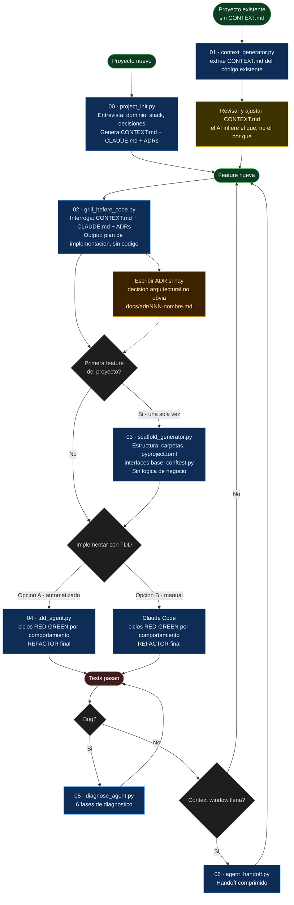

# Módulo 0 — Developer Workflow AI-First

> "El agente es el developer que vive en el repo. Es el único que lo toca. Tu trabajo no es escribir código — es darle todo lo que necesita para hacerlo bien: qué hacer, cómo comportarse, cómo validar, cómo probar y cómo solucionar bugs."

Este módulo no es teórico. Es la configuración de cómo trabajás todos los días.
Los hábitos que instala acá son el 80% del valor — los agentes autónomos del resto del curso los asumen como base.

---

## El cambio de mentalidad

Tratá al agente como a un developer que se incorpora al repo y va a vivir ahí adentro — no como un autocompletado al que le dictás líneas. Un developer nuevo necesita, antes de tocar código, las mismas cinco cosas que un agente:

| Necesidad del developer | Sin esto... | Con el workflow de este módulo |
|---|---|---|
| **Qué hacer** | Adivina el alcance de la feature, sobre-construye o sub-construye | El grill (`02`) clarifica el plan contra `CONTEXT.md` y los ADRs antes de escribir código |
| **Cómo comportarse** | Cada cambio tiene un estilo distinto, reinventa convenciones | `CLAUDE.md` fija las convenciones una sola vez (`00`), el scaffold (`03`) las aplica a la estructura |
| **Cómo validar** | "Funciona en mi máquina", nadie sabe si está realmente listo | Criterio pasa/falla explícito: pytest real corriendo en cada ciclo, no una afirmación |
| **Cómo probar** | Tests escritos después, a las apuradas, cubren lo que ya se implementó | TDD en ciclos verticales (`04`) — el test define el comportamiento antes del código |
| **Cómo solucionar bugs** | Debugging al azar con prints, fix sin entender la causa | Diagnóstico sistemático en 6 fases (`05`) |

El AI-first no significa "dejar que el AI haga todo". Significa **darle al agente, de entrada, todo lo que un developer necesitaría el primer día en el repo** — y que vos puedas confiar en lo que produce porque esas reglas quedaron escritas, no en tu cabeza.

---

## Flujo — vista general

El diagrama es referencial. La explicación detallada de cada paso está en la sección siguiente.



---

## El módulo como Harness

> Harness = Instrucciones + Herramientas + Entorno + Estado + Retroalimentación
> — [Lecture 02: What a Harness Actually Is](https://walkinglabs.github.io/learn-harness-engineering/es/lectures/lecture-02-what-a-harness-actually-is/)

Es el mismo "developer que vive en el repo" de más arriba, visto desde otro ángulo: en vez de las 5 necesidades del developer, son los 5 subsistemas de infraestructura que se las dan. Todo lo que armamos en este módulo es infraestructura alrededor del modelo, no el modelo en sí. Así mapean los 5 subsistemas del harness contra los pasos 00-07:

| Subsistema | Qué cubre acá | Paso(s) |
|---|---|---|
| **Instrucciones** | `CONTEXT.md` (vocabulario de dominio), `CLAUDE.md` (convenciones), ADRs (el "por qué") | 00, 01 |
| **Retroalimentación** | Criterio pasa/falla explícito: pytest real en cada ciclo RED-GREEN, test de regresión al final del diagnóstico | 04, 05 |
| **Estado** | Traspaso de contexto comprimido entre sesiones/agentes (`handoff.json`: completado, decisiones, pendiente) | 06 |
| **Herramientas** | *No se trata como subsistema explícito.* Se asume que el agente ya tiene acceso (leer archivos, correr pytest) — no hay una sección que defina qué herramientas necesita y con qué privilegio mínimo | — |
| **Entorno** | *Parcial.* El scaffold genera `pyproject.toml`, pero no se enmarca como "estado reproducible" (versiones lockeadas, mismo entorno entre sesiones) | 03 (parcial) |

**Por qué importa esta vista:** Instrucciones y Retroalimentación son, según la lección, los de mayor ROI — y son justo los que este módulo más desarrolla (`grill_before_code.py` y el ciclo TDD). Herramientas y Entorno quedan como huecos abiertos: si en tu proyecto el agente falla por acceso insuficiente a comandos, o por que el entorno no es reproducible entre sesiones, esos son los subsistemas a reforzar — no el modelo.

---

## Pasos en detalle

### Paso 00 — Project Init

**Archivo:** `examples/00-project-init/project_init.py`

**Cuándo usarlo:** proyecto nuevo desde cero, antes de escribir cualquier código. Si el proyecto ya tiene código, usá el Paso 01 en cambio.

**Genera un archivo por ejecución.** Mostrá el menú, elegís qué generar, respondés las preguntas. Para el siguiente archivo, volvés a correr.

**Comando:**

```bash
cd examples/00-project-init
export ANTHROPIC_API_KEY="sk-ant-..."

python project_init.py                          # directorio actual
python project_init.py --output /ruta/proyecto  # directorio específico
```

**Menú con estado actual:**

```
Estado actual:
  ✓ CONTEXT.md
  ✗ CLAUDE.md
  ✗ docs/adr/   (sin ADRs)

¿Qué querés generar?
  1. CONTEXT.md  [sobreescribir — backup automático]
  2. CLAUDE.md   ← requiere CONTEXT.md ✓
  3. ADR          (requiere CLAUDE.md primero)
  q. Salir
```

**Reglas de dependencia:**
- `CLAUDE.md` solo habilitado si existe `CONTEXT.md`
- `ADR` solo habilitado si existen `CONTEXT.md` + `CLAUDE.md`

**Backup automático:** si `CONTEXT.md` o `CLAUDE.md` ya existen, el anterior se mueve a `_backups/CONTEXT.md.20240610_143022.bak` antes de escribir el nuevo.

**Validación de contradicciones:** antes de escribir, el agente compara el contenido propuesto con los archivos existentes. Si hay conflictos los muestra con severidad `hard` (incompatibilidad directa) o `soft` (tensión), y pregunta si continuar:

```
  ⚠  [CONFLICTO] CONTEXT.md
    Existente: El sistema es stateless — no almacena sesiones
    Propuesto: Usamos Redis para sesiones de usuario

  ¿Continuar igual? (s = sí / n = cancelar):
```

**Resultado por ejecución:**

| Opción | Genera | Requiere |
|---|---|---|
| 1 | `CONTEXT.md` | — |
| 2 | `CLAUDE.md` | `CONTEXT.md` |
| 3 | `docs/adr/NNN-nombre.md` | `CONTEXT.md` + `CLAUDE.md` |

---

### Sobre los archivos de contexto

Son la memoria persistente del proyecto. Sin ellos, cada sesión de AI empieza de cero.

**`CONTEXT.md`** — el vocabulario compartido entre vos y el AI. Contiene entidades del dominio, sus reglas, y qué NO hace el sistema. El AI lo lee antes de responder cualquier cosa.

**`CLAUDE.md`** — convenciones que el AI sigue sin que se las repitas en cada prompt. Claude Code lo carga automáticamente al abrir el directorio.

**`docs/adr/*.md`** — el "por qué" detrás de las decisiones arquitecturales. Cuando el AI sugiere "simplificá esto a CRUD", el ADR le dice "no, decidimos event sourcing por razón X".

**Señales de que necesitás un nuevo ADR:**
- "¿por qué lo hicimos así?" tiene una respuesta de más de una oración
- El AI sugiere cambiar algo que decidiste conscientemente
- Una decisión implica un trade-off (simplicidad vs trazabilidad, performance vs consistencia)

---

### Paso 01 — Context Generator

**Archivo:** `examples/01-context-generator/context_generator.py`

**Cuándo usarlo:** proyecto existente que no tiene `CONTEXT.md`. Uso único (retrofit). No se usa en proyectos nuevos — en un proyecto nuevo no hay código que analizar.

**Comando:**

```bash
cd examples/01-context-generator
export ANTHROPIC_API_KEY="sk-ant-..."

# Con el sample-repo incluido:
python context_generator.py

# Con tu propio repo:
python context_generator.py /ruta/a/tu/repo
```

**Resultado:** `CONTEXT.md` borrador generado en el directorio del repo analizado.

```
sample-repo/CONTEXT.md  ← borrador con entidades y patrones detectados
```

**Importante:** siempre revisá el resultado. El AI puede inferir el "qué" (qué entidades existen, qué métodos tienen) pero no el "por qué" (por qué se diseñó así, qué trade-offs se hicieron). Esas decisiones las completás vos a mano.

---

### Paso 02 — Grill Before Code

**Archivo:** `examples/02-grill-before-code/grill_before_code.py`

**Cuándo usarlo:** antes de implementar cualquier feature no trivial. Es el paso que separa el workflow AI-first del "escribí esto para mí". El grill te obliga a clarificar el diseño antes de que haya código.

**Comando:**

```bash
cd examples/02-grill-before-code
export ANTHROPIC_API_KEY="sk-ant-..."

python grill_before_code.py "descripción de la feature"

# Ejemplo:
python grill_before_code.py "agregar sistema de cupones de descuento"
```

El script busca automáticamente `CONTEXT.md`, `CLAUDE.md` y `docs/adr/*.md` subiendo hasta 4 niveles desde el directorio actual.

**Resultado:** sesión interactiva donde el AI hace preguntas específicas del dominio (no genéricas), **propone su respuesta recomendada para cada una**, y al final produce un plan de implementación.

```
[Q1] El precio se congela al confirmar (ADR-001). ¿El descuento del cupón
     se aplica antes o después de congelar el precio?
     Recomendación: antes de congelar — así el precio congelado ya incluye
     el descuento y no hay recálculo posterior (consistente con ADR-001).

Tu respuesta (Enter = aceptar recomendación):

[Q2] Según ADR-002, las notificaciones son async. ¿El evento "cupón aplicado"
     también va por la misma cola o tiene canal propio?
     Recomendación: misma cola — no hay requisito de latencia distinto.

...

== Plan de implementación ==
Archivos a crear: src/coupons.py, tests/test_coupons.py
Archivos a modificar: src/orders.py
Reglas: descuento sobre precio congelado, fail-safe en expiración...
```

**Cómo responder:** Enter acepta la recomendación del agente; cualquier texto la corrige. La recomendación está justificada con el contexto del proyecto — si el agente recomienda algo que contradice una decisión tuya no documentada, esa es la señal de que falta un ADR.

**Si el grill reveló una decisión arquitectural no obvia → escribir un ADR antes de seguir.**

---

### ADR — Después del grill

**Cuándo:** si durante el grill acordaron algo que no estaba documentado y que podría confundir al AI (o a un dev nuevo) en el futuro.

**Template:**

```bash
# Crear nuevo ADR (numerarlos secuencialmente)
mkdir -p docs/adr
cat > docs/adr/003-nombre-de-la-decision.md << 'EOF'
# ADR-003: Título de la decisión

## Contexto
Por qué surgió esta decisión. Qué problema resuelve.

## Decisión
Qué se decidió exactamente.

## Consecuencias
- (+) Beneficios
- (-) Trade-offs aceptados
EOF
```

**Resultado:** archivo en `docs/adr/` que el grill y el scaffold leen en la siguiente sesión.

---

### Paso 03 — Scaffold Generator

**Archivo:** `examples/03-scaffold-generator/scaffold_generator.py`

**Cuándo usarlo:** primera feature de un proyecto nuevo — después del grill, antes del primer TDD. Uso único por proyecto. A partir de la segunda feature, la estructura ya existe y este paso se omite.

**Comando:**

```bash
cd examples/03-scaffold-generator
export ANTHROPIC_API_KEY="sk-ant-..."

# Con el plan del grill guardado en archivo:
python scaffold_generator.py --plan grill_plan.txt --output ./output/e-commerce

# El script busca CONTEXT.md y CLAUDE.md automáticamente subiendo directorios
# (encuentra los de 02-grill-before-code si corrés desde esta carpeta)
```

El agente puede hacer hasta 3 preguntas de **estructura** (monorepo vs single package, ORM, etc.) antes de generar. No hace preguntas de dominio — esas ya las hizo el grill.

**Resultado:** estructura del proyecto lista para recibir código de TDD.

```
output/e-commerce/
├── src/
│   ├── __init__.py
│   ├── coupons.py        ← Protocol/ABC, sin implementación
│   ├── orders.py         ← tipos base
│   └── ports.py          ← CouponRepository protocol
├── tests/
│   ├── __init__.py
│   └── conftest.py       ← fixtures comunes
├── pyproject.toml        ← dependencias y config de pytest/ruff
└── .gitignore
```

**Lo que NO genera:** lógica de negocio. Eso lo produce el ciclo TDD.

---

### Paso 04 — TDD

**Cuándo usarlo:** para implementar el plan del grill. Acá aparece el primer código con lógica de negocio.

#### Opción A — `tdd_agent.py` (automatizado)

**Archivo:** `examples/04-tdd-agent/tdd_agent.py`

**Ideal para:** aprender el ciclo TDD, specs bien definidas, módulos aislados sin dependencias complejas.

**Cómo funciona — ciclos verticales (tracer bullets):**

El agente NO escribe todos los tests primero y después toda la implementación. Eso es *horizontal slicing* y produce tests malos: tests escritos en bloque testean comportamiento *imaginado* (la forma de las firmas y estructuras), no comportamiento *real*. En su lugar, el agente trabaja en **ciclos verticales** — un comportamiento por ciclo:

```
FASE PLAN     la spec se descompone en comportamientos observables, ordenados
              del más simple al más complejo. El primero es el tracer bullet:
              el caso mínimo que prueba el camino completo de punta a punta.

CICLO i       (uno por comportamiento)
  RED         escribe UN test para ese comportamiento → corre pytest → debe FALLAR
              (si pasa sin implementar, el comportamiento ya estaba cubierto
               y el ciclo se omite)
  GREEN       escribe el mínimo código para que TODOS los tests pasen
              (los de ciclos anteriores + el nuevo) → corre pytest → verde

FASE REFACTOR única y al final, con toda la suite en verde. Si un refactor
              rompe los tests, el cambio se revierte automáticamente.
```

Cada test se escribe sabiendo lo que enseñó el ciclo anterior — el diseño emerge de a un paso, en vez de comprometerse a una estructura de tests antes de entender la implementación.

**Comando:**

```bash
cd examples/04-tdd-agent
export ANTHROPIC_API_KEY="sk-ant-..."

# Con la spec de ejemplo (BankAccount):
python tdd_agent.py
```

**Output de ejemplo:**

```
--- FASE PLAN: comportamientos a implementar ---
  1. la cuenta se inicializa con balance 0 por defecto  ← tracer bullet
  2. depositar incrementa el balance
  3. depositar monto inválido lanza ValueError
  ...

--- CICLO 1/6: la cuenta se inicializa con balance 0 por defecto ---
  RED:   test_new_account_has_zero_balance → falla ✓
  GREEN: bank_account.py → todos los tests pasan ✓

--- CICLO 2/6: depositar incrementa el balance ---
  RED:   test_deposit_increases_balance → falla ✓
  GREEN: bank_account.py → todos los tests pasan ✓
...
--- FASE REFACTOR: mejorar sin romper ---
```

**Resultado:** dos archivos en `./output/`:

```
output/
├── test_bank_account.py   ← un test por comportamiento, acumulados ciclo a ciclo
└── bank_account.py        ← implementación mínima que los pasa
```

#### Opción B — Claude Code (manual)

**Ideal para:** código de producción, features con decisiones de diseño complejas, cuando querés controlar cada paso.

**Cómo:**

```bash
# 1. Abrís el proyecto en Claude Code desde la raíz:
claude /ruta/a/tu/proyecto

# 2. Pegás el plan del grill como contexto inicial:
"Tengo este plan del grill: [pegás el plan]
 Implementemos con TDD en ciclos verticales: un comportamiento por vez.
 Arrancá con el tracer bullet — UN test para el caso más simple de
 CouponValidator, verificá que falla, y recién ahí la implementación mínima."

# 3. Revisás cada ciclo: test → rojo → implementación → verde

# 4. "Siguiente comportamiento" — repetís hasta cubrir el plan

# 5. Al final, con todo en verde: "refactorizá sin romper los tests"
```

**Resultado:** lo mismo que la Opción A, pero con vos tomando las decisiones de diseño en cada paso.

---

### Paso 05 — Diagnose Agent

**Archivo:** `examples/05-diagnose-agent/diagnose_agent.py`

**Cuándo usarlo:** cuando encontrás un bug y no tenés claro cuál es la causa raíz. No para bugs triviales de typo — para bugs donde el comportamiento es incorrecto de manera no obvia.

**Comando:**

```bash
cd examples/05-diagnose-agent
export ANTHROPIC_API_KEY="sk-ant-..."

python diagnose_agent.py
# Analiza sample-repo/src/discounts.py que tiene 3 bugs intencionales
```

El agente sigue 6 fases:
1. **Reproducir** — confirma que el bug ocurre con un test
2. **Minimizar** — reduce el caso al mínimo que reproduce el bug
3. **Hipotetizar** — lista hipótesis ordenadas por probabilidad
4. **Instrumentar** — agrega logging/prints para confirmar hipótesis
5. **Fix** — aplica el fix mínimo
6. **Test de regresión** — escribe un test que falla sin el fix y pasa con él

**Resultado:**

```
sample-repo/src/discounts.py   ← fix aplicado
sample-repo/tests/test_discounts.py  ← test de regresión agregado
```

---

### Paso 06 — Agent Handoff

**Archivo:** `examples/06-agent-handoff/agent_handoff.py`

**Cuándo usarlo:** cuando la context window del agente actual está llena, o cuando querés pasar trabajo de un agente a otro (ej: de análisis a implementación). Sin handoff, el siguiente agente empieza de cero y repite trabajo.

**Comando:**

```bash
cd examples/06-agent-handoff
export ANTHROPIC_API_KEY="sk-ant-..."

python agent_handoff.py
# Analiza sample-repo/src/auth.py y genera el handoff
```

**Resultado:** `handoff.json` con contexto comprimido:

```json
{
  "completed": "Análisis de AuthService: login, logout, validate_token",
  "decisions": ["Sessions usan JWT", "Expiración en 24h configurable por env"],
  "pending": ["Implementar refresh token", "Agregar rate limiting en login"],
  "context_for_next": "El token de sesión incluye user_id y expires_at..."
}
```

El siguiente agente arranca con este JSON como contexto inicial en lugar de releer todo el historial.

---

### Paso 07 — Full Workflow (demo de integración)

**Archivo:** `examples/07-full-workflow/run_workflow.py`

**Cuándo usarlo:** para ver cómo se encadenan los 4 pasos en una sola ejecución. Es un demo de aprendizaje — en un proyecto real cada paso corre por separado.

**Comando:**

```bash
cd examples/07-full-workflow
export ANTHROPIC_API_KEY="sk-ant-..."

python run_workflow.py          # interactivo (el grill y el scaffold hacen preguntas)
python run_workflow.py --demo   # sin input manual, usa defaults
```

**Resultado:** encadena context → grill → scaffold → TDD y muestra el output de cada paso.

---

## Por qué el contexto importa para el grill

Sin contexto, el AI hace preguntas genéricas:

```
[Q1] ¿Es síncrono o asíncrono?
[Q2] ¿Cómo manejás errores?
```

Con `CONTEXT.md` + ADRs, las preguntas son específicas del dominio:

```
[Q1] Según ADR-002, las notificaciones son async vía Celery.
     ¿Los cupones también deben aplicarse async o en el momento del checkout?
     (Si es async, hay que manejar el caso donde el cupón vence entre que el usuario
     lo ingresa y se procesa el pago)

[Q2] El precio se congela al confirmar (ADR-001).
     ¿El descuento del cupón se aplica antes o después de congelar?
```

La segunda versión evita 2 horas de retrabajo.

---

## ¿Es necesario Python para esto?

**Para usar el workflow en tu día a día: no.** Estos mismos patrones existen como *skills* de Claude Code — archivos `SKILL.md` que son solo instrucciones de workflow, sin código. Claude Code ya tiene las herramientas (leer archivos, explorar el repo, correr pytest), así que la skill únicamente le dice *cómo* trabajar:

| Script de este módulo | Equivalente como skill (ej: [mattpocock/skills](https://github.com/mattpocock/skills)) |
|---|---|
| `grill_before_code.py` | `/grill-me` (interrogatorio) + `/grill-with-docs` (con CONTEXT.md y ADRs) |
| `tdd_agent.py` | `/tdd` (ciclos verticales red-green-refactor) |
| `diagnose_agent.py` | `/diagnose` (debugging sistemático) |

Las skills tienen además una ventaja: el agente de Claude Code puede **explorar el código en vez de preguntarte** ("si una pregunta se responde mirando el codebase, mirá el codebase"), cosa que los scripts de este módulo no hacen — solo leen CONTEXT.md, CLAUDE.md y ADRs.

**¿Entonces para qué los scripts en Python?** Dos razones:

1. **Didáctica (el punto de este módulo):** las skills asumen que el loop agéntico existe y funciona. Los scripts lo construyen a mano — `tool_use`/`tool_result`, fases con system prompts distintos, verificación con pytest real, criterio de "listo" explícito. Entender ese loop es la base de los módulos 1 en adelante.
2. **Automatización fuera del editor:** si el workflow tiene que correr sin un humano en Claude Code — en CI, en un pipeline, dentro de un producto — necesitás el loop programático. Ahí el script es el punto de partida.

Regla práctica: **en tu editor, usá skills; en automatización, usá el loop programático.**

---

## Estructura de ejemplos

```
examples/
├── 00-project-init/
│   ├── project_init.py        ← entrevista al dev, genera CONTEXT.md + CLAUDE.md + ADRs
│   └── README.md              ← output de ejemplo con archivos generados
│
├── 01-context-generator/
│   ├── context_generator.py   ← analiza repo existente, genera CONTEXT.md
│   └── sample-repo/           ← codebase e-commerce para el demo
│       ├── src/               (Order, Payment, NotificationService)
│       └── tests/
│
├── 02-grill-before-code/
│   ├── grill_before_code.py   ← interroga antes de codear (con respuesta recomendada)
│   ├── CONTEXT.md             ← dominio del proyecto de ejemplo
│   ├── CLAUDE.md              ← convenciones del proyecto
│   └── docs/adr/
│       ├── 001-precio-congelado-en-confirmacion.md
│       └── 002-notificaciones-desacopladas-del-dominio.md
│
├── 03-scaffold-generator/
│   ├── scaffold_generator.py  ← genera estructura desde contexto + plan
│   ├── grill_plan.txt         ← plan de ejemplo (output del grill)
│   └── README.md
│
├── 04-tdd-agent/
│   ├── tdd_agent.py           ← ciclos verticales RED→GREEN + refactor final
│   └── specs/                 ← specs de ejemplo para practicar
│       ├── discount_calculator_spec.md
│       └── order_validator_spec.md
│
├── 05-diagnose-agent/
│   ├── diagnose_agent.py      ← debugging sistemático en 6 fases
│   └── sample-repo/
│       └── src/discounts.py   ← 3 bugs intencionales para diagnosticar
│
├── 06-agent-handoff/
│   ├── agent_handoff.py       ← traspaso de contexto entre agentes
│   └── sample-repo/
│       └── src/auth.py        ← AuthService para el demo
│
└── 07-full-workflow/
    └── run_workflow.py        ← encadena los 4 pasos del flujo completo
```

---

## Setup

```bash
pip install anthropic
export ANTHROPIC_API_KEY="sk-ant-..."
```

Los ejemplos 01-06 son independientes entre sí. El 07 encadena los 4 primeros.

---

## Para tu propio proyecto

### Proyecto nuevo (greenfield)

```bash
# 1. Generar CONTEXT.md + CLAUDE.md + ADRs con el agente de init:
cd /ruta/a/mi-nuevo-proyecto
python /ruta/a/module-00/examples/00-project-init/project_init.py
# → te hace preguntas sobre dominio, stack y decisiones
# → revisá y ajustá los archivos generados

# 2. Grill para la primera feature:
cd /ruta/a/tu/repo
python /ruta/a/module-00/examples/02-grill-before-code/grill_before_code.py "descripción de la feature"
# → genera el plan; si hay decisión no obvia, escribir ADR antes de continuar

# 4. Scaffold (solo la primera vez):
python /ruta/a/module-00/examples/03-scaffold-generator/scaffold_generator.py \
  --plan plan-del-grill.txt --output .

# 5a. TDD automatizado con el plan como spec:
python /ruta/a/module-00/examples/04-tdd-agent/tdd_agent.py

# 5b. O TDD manual en Claude Code:
#     claude /ruta/a/tu/repo
#     [pegás el plan del grill como contexto y guiás el ciclo RED→GREEN→REFACTOR]

# Para cada feature siguiente: volvés al paso 3 (no al 4 — scaffold ya existe)
```

### Proyecto existente sin CONTEXT.md (brownfield)

```bash
# 1. Extraer CONTEXT.md del código existente:
python /ruta/a/module-00/examples/01-context-generator/context_generator.py /ruta/a/tu/repo
# → revisar y ajustar — el AI infiere el qué, no el por qué

# 2. Escribir CLAUDE.md y el primer ADR para la decisión más importante del sistema

# 3. Grill para la próxima feature (no hay scaffold — la estructura ya existe):
cd /ruta/a/tu/repo
python /ruta/a/module-00/examples/02-grill-before-code/grill_before_code.py "descripción de la feature"

# 4. TDD directamente (opción A o B)
```

---

Siguiente: [Módulo 1 → Fundamentos de Agentes](../module-01-fundamentals/README.md)
