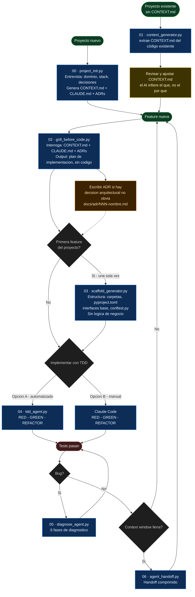

# Módulo 0 — Developer Workflow AI-First

> "El AI no es tu asistente de escritura. Es tu par de trabajo. Vos diseñás, él ejecuta. Pero para ejecutar bien, necesita contexto."

Este módulo no es teórico. Es la configuración de cómo trabajás todos los días.
Los hábitos que instala acá son el 80% del valor — los agentes autónomos del resto del curso los asumen como base.

---

## El cambio de mentalidad

| Workflow tradicional | Workflow AI-first |
|---|---|
| "Escribime esta función" | El AI entiende el dominio antes de codear |
| Empezar a codear y ver qué sale | Clarificar el diseño primero (grill) |
| Debuggear al azar con prints | Diagnóstico sistemático en 6 fases |
| Copiar contexto manualmente entre sesiones | Contexto persistente en archivos (`CONTEXT.md`, ADRs) |
| Implementar y escribir tests después | Tests primero, siempre (TDD) |

El AI-first no significa "dejar que el AI haga todo". Significa **estructurar el trabajo para que el AI pueda hacer más con menos fricción** — y que vos puedas confiar en lo que produce.

---

## Flujo — vista general

El diagrama es referencial. La explicación detallada de cada paso está en la sección siguiente.



---

## Pasos en detalle

### Paso 00 — Project Init

**Archivo:** `examples/00-project-init/project_init.py`

**Cuándo usarlo:** proyecto nuevo desde cero, antes de escribir cualquier código. Si el proyecto ya tiene código, usá el Paso 01 en cambio.

**Genera un archivo por ejecución.** Mostrá el menú, elegís qué generar, respondés las preguntas. Para el siguiente archivo, volvés a correr.

**Comando:**

```bash
cd examples/00-project-init
export ANTHROPIC_API_KEY="sk-ant-..."

python project_init.py                          # directorio actual
python project_init.py --output /ruta/proyecto  # directorio específico
```

**Menú con estado actual:**

```
Estado actual:
  ✓ CONTEXT.md
  ✗ CLAUDE.md
  ✗ docs/adr/   (sin ADRs)

¿Qué querés generar?
  1. CONTEXT.md  [sobreescribir — backup automático]
  2. CLAUDE.md   ← requiere CONTEXT.md ✓
  3. ADR          (requiere CLAUDE.md primero)
  q. Salir
```

**Reglas de dependencia:**
- `CLAUDE.md` solo habilitado si existe `CONTEXT.md`
- `ADR` solo habilitado si existen `CONTEXT.md` + `CLAUDE.md`

**Backup automático:** si `CONTEXT.md` o `CLAUDE.md` ya existen, el anterior se mueve a `_backups/CONTEXT.md.20240610_143022.bak` antes de escribir el nuevo.

**Validación de contradicciones:** antes de escribir, el agente compara el contenido propuesto con los archivos existentes. Si hay conflictos los muestra con severidad `hard` (incompatibilidad directa) o `soft` (tensión), y pregunta si continuar:

```
  ⚠  [CONFLICTO] CONTEXT.md
    Existente: El sistema es stateless — no almacena sesiones
    Propuesto: Usamos Redis para sesiones de usuario

  ¿Continuar igual? (s = sí / n = cancelar):
```

**Resultado por ejecución:**

| Opción | Genera | Requiere |
|---|---|---|
| 1 | `CONTEXT.md` | — |
| 2 | `CLAUDE.md` | `CONTEXT.md` |
| 3 | `docs/adr/NNN-nombre.md` | `CONTEXT.md` + `CLAUDE.md` |

---

### Sobre los archivos de contexto

Son la memoria persistente del proyecto. Sin ellos, cada sesión de AI empieza de cero.

**`CONTEXT.md`** — el vocabulario compartido entre vos y el AI. Contiene entidades del dominio, sus reglas, y qué NO hace el sistema. El AI lo lee antes de responder cualquier cosa.

**`CLAUDE.md`** — convenciones que el AI sigue sin que se las repitas en cada prompt. Claude Code lo carga automáticamente al abrir el directorio.

**`docs/adr/*.md`** — el "por qué" detrás de las decisiones arquitecturales. Cuando el AI sugiere "simplificá esto a CRUD", el ADR le dice "no, decidimos event sourcing por razón X".

**Señales de que necesitás un nuevo ADR:**
- "¿por qué lo hicimos así?" tiene una respuesta de más de una oración
- El AI sugiere cambiar algo que decidiste conscientemente
- Una decisión implica un trade-off (simplicidad vs trazabilidad, performance vs consistencia)

---

### Paso 01 — Context Generator

**Archivo:** `examples/01-context-generator/context_generator.py`

**Cuándo usarlo:** proyecto existente que no tiene `CONTEXT.md`. Uso único (retrofit). No se usa en proyectos nuevos — en un proyecto nuevo no hay código que analizar.

**Comando:**

```bash
cd examples/01-context-generator
export ANTHROPIC_API_KEY="sk-ant-..."

# Con el sample-repo incluido:
python context_generator.py

# Con tu propio repo:
python context_generator.py /ruta/a/tu/repo
```

**Resultado:** `CONTEXT.md` borrador generado en el directorio del repo analizado.

```
sample-repo/CONTEXT.md  ← borrador con entidades y patrones detectados
```

**Importante:** siempre revisá el resultado. El AI puede inferir el "qué" (qué entidades existen, qué métodos tienen) pero no el "por qué" (por qué se diseñó así, qué trade-offs se hicieron). Esas decisiones las completás vos a mano.

---

### Paso 02 — Grill Before Code

**Archivo:** `examples/02-grill-before-code/grill_before_code.py`

**Cuándo usarlo:** antes de implementar cualquier feature no trivial. Es el paso que separa el workflow AI-first del "escribí esto para mí". El grill te obliga a clarificar el diseño antes de que haya código.

**Comando:**

```bash
cd examples/02-grill-before-code
export ANTHROPIC_API_KEY="sk-ant-..."

python grill_before_code.py "descripción de la feature"

# Ejemplo:
python grill_before_code.py "agregar sistema de cupones de descuento"
```

El script busca automáticamente `CONTEXT.md`, `CLAUDE.md` y `docs/adr/*.md` subiendo hasta 4 niveles desde el directorio actual.

**Resultado:** sesión interactiva donde el AI hace preguntas específicas del dominio (no genéricas) y al final produce un plan de implementación.

```
[Q1] El precio se congela al confirmar (ADR-001). ¿El descuento del cupón
     se aplica antes o después de congelar el precio?

[Q2] Según ADR-002, las notificaciones son async. ¿El evento "cupón aplicado"
     también va por la misma cola o tiene canal propio?

...

== Plan de implementación ==
Archivos a crear: src/coupons.py, tests/test_coupons.py
Archivos a modificar: src/orders.py
Reglas: descuento sobre precio congelado, fail-safe en expiración...
```

**Si el grill reveló una decisión arquitectural no obvia → escribir un ADR antes de seguir.**

---

### ADR — Después del grill

**Cuándo:** si durante el grill acordaron algo que no estaba documentado y que podría confundir al AI (o a un dev nuevo) en el futuro.

**Template:**

```bash
# Crear nuevo ADR (numerarlos secuencialmente)
mkdir -p docs/adr
cat > docs/adr/003-nombre-de-la-decision.md << 'EOF'
# ADR-003: Título de la decisión

## Contexto
Por qué surgió esta decisión. Qué problema resuelve.

## Decisión
Qué se decidió exactamente.

## Consecuencias
- (+) Beneficios
- (-) Trade-offs aceptados
EOF
```

**Resultado:** archivo en `docs/adr/` que el grill y el scaffold leen en la siguiente sesión.

---

### Paso 03 — Scaffold Generator

**Archivo:** `examples/03-scaffold-generator/scaffold_generator.py`

**Cuándo usarlo:** primera feature de un proyecto nuevo — después del grill, antes del primer TDD. Uso único por proyecto. A partir de la segunda feature, la estructura ya existe y este paso se omite.

**Comando:**

```bash
cd examples/03-scaffold-generator
export ANTHROPIC_API_KEY="sk-ant-..."

# Con el plan del grill guardado en archivo:
python scaffold_generator.py --plan grill_plan.txt --output ./output/e-commerce

# El script busca CONTEXT.md y CLAUDE.md automáticamente subiendo directorios
# (encuentra los de 02-grill-before-code si corrés desde esta carpeta)
```

El agente puede hacer hasta 3 preguntas de **estructura** (monorepo vs single package, ORM, etc.) antes de generar. No hace preguntas de dominio — esas ya las hizo el grill.

**Resultado:** estructura del proyecto lista para recibir código de TDD.

```
output/e-commerce/
├── src/
│   ├── __init__.py
│   ├── coupons.py        ← Protocol/ABC, sin implementación
│   ├── orders.py         ← tipos base
│   └── ports.py          ← CouponRepository protocol
├── tests/
│   ├── __init__.py
│   └── conftest.py       ← fixtures comunes
├── pyproject.toml        ← dependencias y config de pytest/ruff
└── .gitignore
```

**Lo que NO genera:** lógica de negocio. Eso lo produce el ciclo TDD.

---

### Paso 04 — TDD

**Cuándo usarlo:** para implementar el plan del grill. Acá aparece el primer código con lógica de negocio.

#### Opción A — `tdd_agent.py` (automatizado)

**Archivo:** `examples/04-tdd-agent/tdd_agent.py`

**Ideal para:** aprender el ciclo TDD, specs bien definidas, módulos aislados sin dependencias complejas.

**Comando:**

```bash
cd examples/04-tdd-agent
export ANTHROPIC_API_KEY="sk-ant-..."

# Con la spec de ejemplo (BankAccount):
python tdd_agent.py

# El agente hace el ciclo completo sin intervención:
#   RED:     escribe los tests (todos fallan)
#   GREEN:   escribe el mínimo código para que pasen
#   REFACTOR: mejora el código sin romper tests
```

**Resultado:** dos archivos en `./output/`:

```
output/
├── test_bank_account.py   ← tests exhaustivos (casos normales, borde, error)
└── bank_account.py        ← implementación mínima que los pasa
```

#### Opción B — Claude Code (manual)

**Ideal para:** código de producción, features con decisiones de diseño complejas, cuando querés controlar cada paso.

**Cómo:**

```bash
# 1. Abrís el proyecto en Claude Code desde la raíz:
claude /ruta/a/tu/proyecto

# 2. Pegás el plan del grill como contexto inicial:
"Tengo este plan del grill: [pegás el plan]
 Arrancamos con el ciclo TDD. Primero escribí los tests para CouponValidator."

# 3. Revisás los tests, pedís ajustes si hace falta

# 4. "Ahora escribí la implementación mínima para pasar los tests"

# 5. Revisás, pedís refactor si hace falta
```

**Resultado:** lo mismo que la Opción A, pero con vos tomando las decisiones de diseño en cada paso.

---

### Paso 05 — Diagnose Agent

**Archivo:** `examples/05-diagnose-agent/diagnose_agent.py`

**Cuándo usarlo:** cuando encontrás un bug y no tenés claro cuál es la causa raíz. No para bugs triviales de typo — para bugs donde el comportamiento es incorrecto de manera no obvia.

**Comando:**

```bash
cd examples/05-diagnose-agent
export ANTHROPIC_API_KEY="sk-ant-..."

python diagnose_agent.py
# Analiza sample-repo/src/discounts.py que tiene 3 bugs intencionales
```

El agente sigue 6 fases:
1. **Reproducir** — confirma que el bug ocurre con un test
2. **Minimizar** — reduce el caso al mínimo que reproduce el bug
3. **Hipotetizar** — lista hipótesis ordenadas por probabilidad
4. **Instrumentar** — agrega logging/prints para confirmar hipótesis
5. **Fix** — aplica el fix mínimo
6. **Test de regresión** — escribe un test que falla sin el fix y pasa con él

**Resultado:**

```
sample-repo/src/discounts.py   ← fix aplicado
sample-repo/tests/test_discounts.py  ← test de regresión agregado
```

---

### Paso 06 — Agent Handoff

**Archivo:** `examples/06-agent-handoff/agent_handoff.py`

**Cuándo usarlo:** cuando la context window del agente actual está llena, o cuando querés pasar trabajo de un agente a otro (ej: de análisis a implementación). Sin handoff, el siguiente agente empieza de cero y repite trabajo.

**Comando:**

```bash
cd examples/06-agent-handoff
export ANTHROPIC_API_KEY="sk-ant-..."

python agent_handoff.py
# Analiza sample-repo/src/auth.py y genera el handoff
```

**Resultado:** `handoff.json` con contexto comprimido:

```json
{
  "completed": "Análisis de AuthService: login, logout, validate_token",
  "decisions": ["Sessions usan JWT", "Expiración en 24h configurable por env"],
  "pending": ["Implementar refresh token", "Agregar rate limiting en login"],
  "context_for_next": "El token de sesión incluye user_id y expires_at..."
}
```

El siguiente agente arranca con este JSON como contexto inicial en lugar de releer todo el historial.

---

### Paso 07 — Full Workflow (demo de integración)

**Archivo:** `examples/07-full-workflow/run_workflow.py`

**Cuándo usarlo:** para ver cómo se encadenan los 4 pasos en una sola ejecución. Es un demo de aprendizaje — en un proyecto real cada paso corre por separado.

**Comando:**

```bash
cd examples/07-full-workflow
export ANTHROPIC_API_KEY="sk-ant-..."

python run_workflow.py          # interactivo (el grill y el scaffold hacen preguntas)
python run_workflow.py --demo   # sin input manual, usa defaults
```

**Resultado:** encadena context → grill → scaffold → TDD y muestra el output de cada paso.

---

## Por qué el contexto importa para el grill

Sin contexto, el AI hace preguntas genéricas:

```
[Q1] ¿Es síncrono o asíncrono?
[Q2] ¿Cómo manejás errores?
```

Con `CONTEXT.md` + ADRs, las preguntas son específicas del dominio:

```
[Q1] Según ADR-002, las notificaciones son async vía Celery.
     ¿Los cupones también deben aplicarse async o en el momento del checkout?
     (Si es async, hay que manejar el caso donde el cupón vence entre que el usuario
     lo ingresa y se procesa el pago)

[Q2] El precio se congela al confirmar (ADR-001).
     ¿El descuento del cupón se aplica antes o después de congelar?
```

La segunda versión evita 2 horas de retrabajo.

---

## Estructura de ejemplos

```
examples/
├── 00-project-init/
│   ├── project_init.py        ← entrevista al dev, genera CONTEXT.md + CLAUDE.md + ADRs
│   └── README.md              ← output de ejemplo con archivos generados
│
├── 01-context-generator/
│   ├── context_generator.py   ← analiza repo existente, genera CONTEXT.md
│   └── sample-repo/           ← codebase e-commerce para el demo
│       ├── src/               (Order, Payment, NotificationService)
│       └── tests/
│
├── 02-grill-before-code/
│   ├── grill_before_code.py   ← interroga antes de codear
│   ├── CONTEXT.md             ← dominio del proyecto de ejemplo
│   ├── CLAUDE.md              ← convenciones del proyecto
│   └── docs/adr/
│       ├── 001-precio-congelado-en-confirmacion.md
│       └── 002-notificaciones-desacopladas-del-dominio.md
│
├── 03-scaffold-generator/
│   ├── scaffold_generator.py  ← genera estructura desde contexto + plan
│   ├── grill_plan.txt         ← plan de ejemplo (output del grill)
│   └── README.md
│
├── 04-tdd-agent/
│   ├── tdd_agent.py           ← Red → Green → Refactor automático
│   └── specs/                 ← specs de ejemplo para practicar
│       ├── discount_calculator_spec.md
│       └── order_validator_spec.md
│
├── 05-diagnose-agent/
│   ├── diagnose_agent.py      ← debugging sistemático en 6 fases
│   └── sample-repo/
│       └── src/discounts.py   ← 3 bugs intencionales para diagnosticar
│
├── 06-agent-handoff/
│   ├── agent_handoff.py       ← traspaso de contexto entre agentes
│   └── sample-repo/
│       └── src/auth.py        ← AuthService para el demo
│
└── 07-full-workflow/
    └── run_workflow.py        ← encadena los 4 pasos del flujo completo
```

---

## Setup

```bash
pip install anthropic
export ANTHROPIC_API_KEY="sk-ant-..."
```

Los ejemplos 01-06 son independientes entre sí. El 07 encadena los 4 primeros.

---

## Para tu propio proyecto

### Proyecto nuevo (greenfield)

```bash
# 1. Generar CONTEXT.md + CLAUDE.md + ADRs con el agente de init:
cd /ruta/a/mi-nuevo-proyecto
python /ruta/a/module-00/examples/00-project-init/project_init.py
# → te hace preguntas sobre dominio, stack y decisiones
# → revisá y ajustá los archivos generados

# 2. Grill para la primera feature:
cd /ruta/a/tu/repo
python /ruta/a/module-00/examples/02-grill-before-code/grill_before_code.py "descripción de la feature"
# → genera el plan; si hay decisión no obvia, escribir ADR antes de continuar

# 4. Scaffold (solo la primera vez):
python /ruta/a/module-00/examples/03-scaffold-generator/scaffold_generator.py \
  --plan plan-del-grill.txt --output .

# 5a. TDD automatizado con el plan como spec:
python /ruta/a/module-00/examples/04-tdd-agent/tdd_agent.py

# 5b. O TDD manual en Claude Code:
#     claude /ruta/a/tu/repo
#     [pegás el plan del grill como contexto y guiás el ciclo RED→GREEN→REFACTOR]

# Para cada feature siguiente: volvés al paso 3 (no al 4 — scaffold ya existe)
```

### Proyecto existente sin CONTEXT.md (brownfield)

```bash
# 1. Extraer CONTEXT.md del código existente:
python /ruta/a/module-00/examples/01-context-generator/context_generator.py /ruta/a/tu/repo
# → revisar y ajustar — el AI infiere el qué, no el por qué

# 2. Escribir CLAUDE.md y el primer ADR para la decisión más importante del sistema

# 3. Grill para la próxima feature (no hay scaffold — la estructura ya existe):
cd /ruta/a/tu/repo
python /ruta/a/module-00/examples/02-grill-before-code/grill_before_code.py "descripción de la feature"

# 4. TDD directamente (opción A o B)
```

---

Siguiente: [Módulo 1 → Fundamentos de Agentes](../module-01-fundamentals/README.md)
